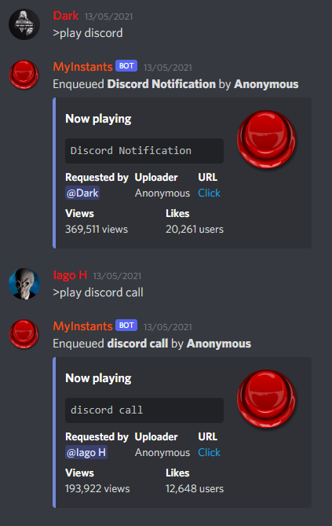

[![Contributors][contributors-shield]][contributors-url]
[![Forks][forks-shield]][forks-url]
[![Stargazers][stars-shield]][stars-url]
[![Issues][issues-shield]][issues-url]
[![MIT License][license-shield]][license-url]
[![LinkedIn][linkedin-shield]][linkedin-url]

 

  

  <h3 align="center">MyInstants Discord Bot</h3>

  

    A simple discord bot to play <a href="https://www.myinstants.com/">MyInstants</a> sounds.
     
     
    <a href="https://discord.com/api/oauth2/authorize?client_id=836019264124354571&permissions=3164224&scope=bot">
        Invite the bot to your Discord server!
         
        
    </a>
     
     
    <a href="#commands">View Commands</a>
    ·
    <a href="https://github.com/mgiovani/my-instants-discord-bot/issues">Report Bug</a>
    ·
    <a href="https://github.com/mgiovani/my-instants-discord-bot/issues">Request Feature</a>
  

## Commands

- ``>play {something to search}``
- ``>join``
- ``>leave``
- ``>loop``
- ``>now``
- ``>pause``
- ``>queue``
- ``>remove``
- ``>resume``
- ``>shuffle``
- ``>skip``

## Summary

<ol>
<li>
    <a href="#about-the-project">About The Project</a>
    <ul>
    <li><a href="#built-with">Built With</a></li>
    </ul>
</li>
<li><a href="#contributing">Contributing</a></li>
<li><a href="#license">License</a></li>
<li><a href="#contact">Contact</a></li>
</ol>

## About The Project

### Built With

* [Discord.py](https://discordpy.readthedocs.io/en/stable/)
* [FFmpeg](https://www.ffmpeg.org/)

## Contributing

Contributions are what make the open source community such an amazing place to be learn, inspire, and create. Any contributions you make are **greatly appreciated**.

1. Fork the Project
2. Create your Feature Branch (`git checkout -b feature/AmazingFeature`)
3. Commit your Changes (`git commit -m 'Add some AmazingFeature'`)
4. Push to the Branch (`git push origin feature/AmazingFeature`)
5. Open a Pull Request

## License

Distributed under the MIT License. See `LICENSE` for more information.

## Contact

Giovani Moutinho - [Linkedin](https://www.linkedin.com/in/mgiovani/)

Project Link: [https://github.com/mgiovani/my-instants-discord-bot](https://github.com/mgiovani/my-instants-discord-bot)

[contributors-shield]: https://img.shields.io/github/contributors/mgiovani/my-instants-discord-bot.svg?style=for-the-badge
[contributors-url]: https://github.com/mgiovani/my-instants-discord-bot/graphs/contributors
[forks-shield]: https://img.shields.io/github/forks/mgiovani/my-instants-discord-bot.svg?style=for-the-badge
[forks-url]: https://github.com/mgiovani/my-instants-discord-bot/network/members
[stars-shield]: https://img.shields.io/github/stars/mgiovani/my-instants-discord-bot.svg?style=for-the-badge
[stars-url]: https://github.com/mgiovani/my-instants-discord-bot/stargazers
[issues-shield]: https://img.shields.io/github/issues/mgiovani/my-instants-discord-bot.svg?style=for-the-badge
[issues-url]: https://github.com/mgiovani/my-instants-discord-bot/issues
[license-shield]: https://img.shields.io/github/license/mgiovani/my-instants-discord-bot.svg?style=for-the-badge
[license-url]: https://github.com/mgiovani/my-instants-discord-bot/blob/main/LICENSE
[linkedin-shield]: https://img.shields.io/badge/-LinkedIn-black.svg?style=for-the-badge&logo=linkedin&colorB=555
[linkedin-url]: https://linkedin.com/in/mgiovani
